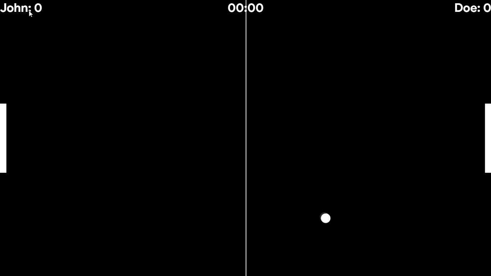
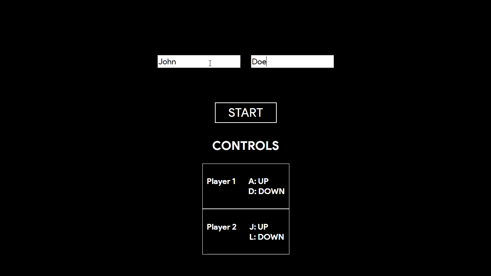
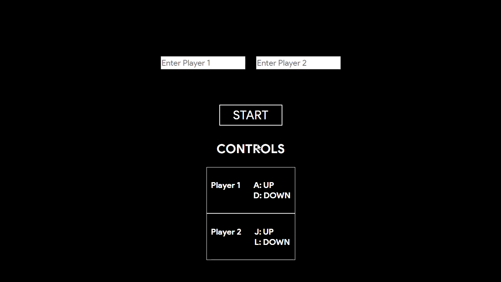
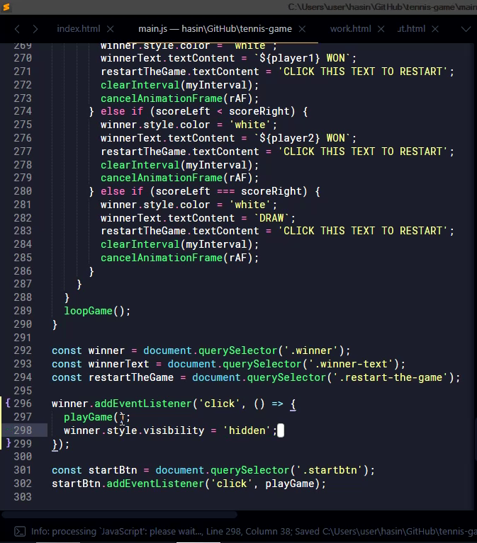

## Javascript Tennis Game

A game created using **HTML**, **CSS**, and **Vanilla JavaScript (no special framework)** with special usage of Canvas API.

The main controls for the game are shown at the beginning but basically this is how it works

1. Display a screen the starting screen with two inputs for names, start button and a little help of keys usage.

2. Enter the names of the players

3. Press **START** button and the game will start playing ***make sure you use the keys shown for each player***.

4. During the game, if one of players scores 20 before another, he or she will *win*. Another case of winning is the player who will have scored more in *first 10 minutes of the game* will also be the winner.
.

Feel free to tell me what I can add to the project to make it more advanced and useful for anyone who want to use this game.

#### This is the some part of the code.

## proprgrmmr on Instagram [Instagram](https://www.instagram.com/proprgrmmr), Twitter [Twitter]('https://twitter.com/proprgrmmr') Facebook[Facebook](https://web.facebook.com/pro.programmer.14) :100: 